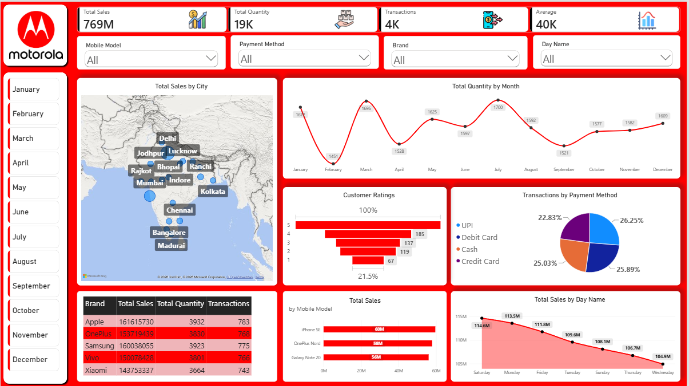

# 📱 Mobile Sales Interactive Dashboard

An interactive **Power BI** dashboard that tracks mobile phone sales performance — revenue, volume, transactions, customer ratings, and regional trends — all on a single, sleek, drill-down enabled dashboard page. 🚀📊

---

## 📑 Table of Contents

- [✨ Overview](#-overview)
- [🖥️ Dashboard Preview](#️-dashboard-preview)
- [🧩 Key Features](#-key-features)
- [📈 Visuals & Components](#-visuals--components)
- [🗄️ Data Model](#️-data-model)
- [🎨 Design & Theming](#-design--theming)
- [🛠️ Tech Stack](#️-tech-stack)
- [🚀 How to Use](#-how-to-use)
- [💡 Insights You Can Derive](#-insights-you-can-derive)
- [📂 File Structure](#-file-structure)
- [🤝 Contributing](#-contributing)
- [📬 Contact](#-contact)

---

## ✨ Overview

This project is a **single-page, fully interactive Power BI dashboard** built on a `Sales data` table to help analyze mobile phone sales across brands, models, cities, and payment methods. It's designed to be:

- 🔍 **Explorable** – click, filter, and drill into any metric
- ⚡ **Fast** – optimized DAX measures for instant refresh
- 🎯 **Actionable** – surfaces top brands, best-selling models, and customer sentiment at a glance

---

## 🖥️ Dashboard Preview





## 🧩 Key Features

✅ **KPI Summary Cards** – instant snapshot of overall performance
✅ **Multi-level Slicers** – filter by Brand, Model, Payment Method, Day, and Date
✅ **Geo Map Visualization** – see sales concentration by city
✅ **Trend Analysis** – track sales/quantity over time (Month ➡️ Day drill-down)
✅ **Customer Sentiment Funnel** – visualize the ratings distribution
✅ **Brand Comparison Table** – Total Sales, Quantity & Transactions per brand
✅ **Custom Branded Theme** – Motorola-inspired color palette & logos
✅ **Fully Cross-Filtered Visuals** – click on any chart to filter the rest 🔗

---

## 📈 Visuals & Components

| Visual | Type | What It Shows |
|---|---|---|
| 💰 Total Sales | KPI Card | Overall revenue generated |
| 📦 Total Quantity | KPI Card | Total units sold |
| 🧾 Transactions | KPI Card | Total number of transactions |
| 📊 Average | KPI Card | Average sale value |
| 🗺️ Sales by City | Map (bubble) | Geographic distribution of sales, sized by revenue |
| 📉 Sales Trend | Line Chart | Total Quantity over time (Month/Day drill-down) |
| 📶 Sales by Mobile Model | Bar Chart | Top-performing phone models by revenue |
| 🔻 Customer Ratings | Funnel Chart | Distribution/funnel of customer satisfaction |
| 🌄 Sales by Day | Area Chart | Total Sales trend across days of the week |
| 🥧 Payment Method Split | Pie Chart | Share of transactions by payment type |
| 📋 Brand Summary Table | Table | Brand-wise Total Sales, Quantity & Transactions |
| 🎚️ Slicers | Brand • Model • Payment Method • Day Name • Date | Interactive filtering across the whole page |

---

## 🗄️ Data Model

The dashboard runs off a single core table, **`Sales data`**, with the following key fields:

**📁 Dimensions (Columns)**
- 🏷️ Brand
- 📱 Mobile Model
- 🏙️ City
- ⭐ Customer Ratings
- 💳 Payment Method
- 📅 Day Name
- 🗓️ Date (with a built-in Year → Quarter → Month → Day hierarchy)

**🧮 Measures (DAX)**
- `Total Sales`
- `Total Quantity`
- `Transactions`
- `Average`

---

## 🎨 Design & Theming

- 🎨 Custom JSON color theme layered on top of Power BI's Fluent 2 base theme
- 📱 Motorola and other mobile-brand logos embedded as report images
- 🟥 Bold accent background for strong visual identity
- 🖼️ Decorative shapes for a clean, modern dashboard layout
- 📐 Optimized for a **1920×1080** full-screen "Dashboard" page

---

## 🛠️ Tech Stack

- **Power BI Desktop** (`.pbix`) 🟨
- **DAX** for measures and calculations 🧮
- **Power Query (M)** for data shaping *(if applicable)* 🔄
- **Fluent 2 theming** + custom JSON theme 🎨

---

## 🚀 How to Use

1. 📥 **Download** `Mobile_Sales_INTERACTIVE_DASHBOARD.pbix` from this repo
2. 🖥️ **Open** it in [Power BI Desktop](https://powerbi.microsoft.com/desktop/)
3. 🔄 **Refresh** the data source (if connected to a live dataset)
4. 🎛️ **Interact**:
   - Use the top slicers to filter by Brand, Model, Payment Method, or Day
   - Click any bar, slice, or map bubble to cross-filter the whole dashboard
   - Drill into the line chart from **Month ➡️ Day** for granular trends
5. 📤 **Publish** to Power BI Service to share with your team (optional)

---

## 💡 Insights You Can Derive

- 🏆 Which mobile brand/model drives the most revenue
- 🌍 Which cities generate the highest sales volume
- 💳 The most-preferred payment method among customers
- ⭐ How satisfied customers are, based on the ratings funnel
- 📆 Which days of the week see peak sales activity
- 📈 Seasonal or monthly sales/quantity trends

---

## 📂 File Structure

```
📦 Mobile-Sales-Interactive-Dashboard
 ┣ 📄 Mobile_Sales_INTERACTIVE_DASHBOARD.pbix   # Power BI dashboard file
 ┗ 📄 README.md                                  # Project documentation (this file)
```


